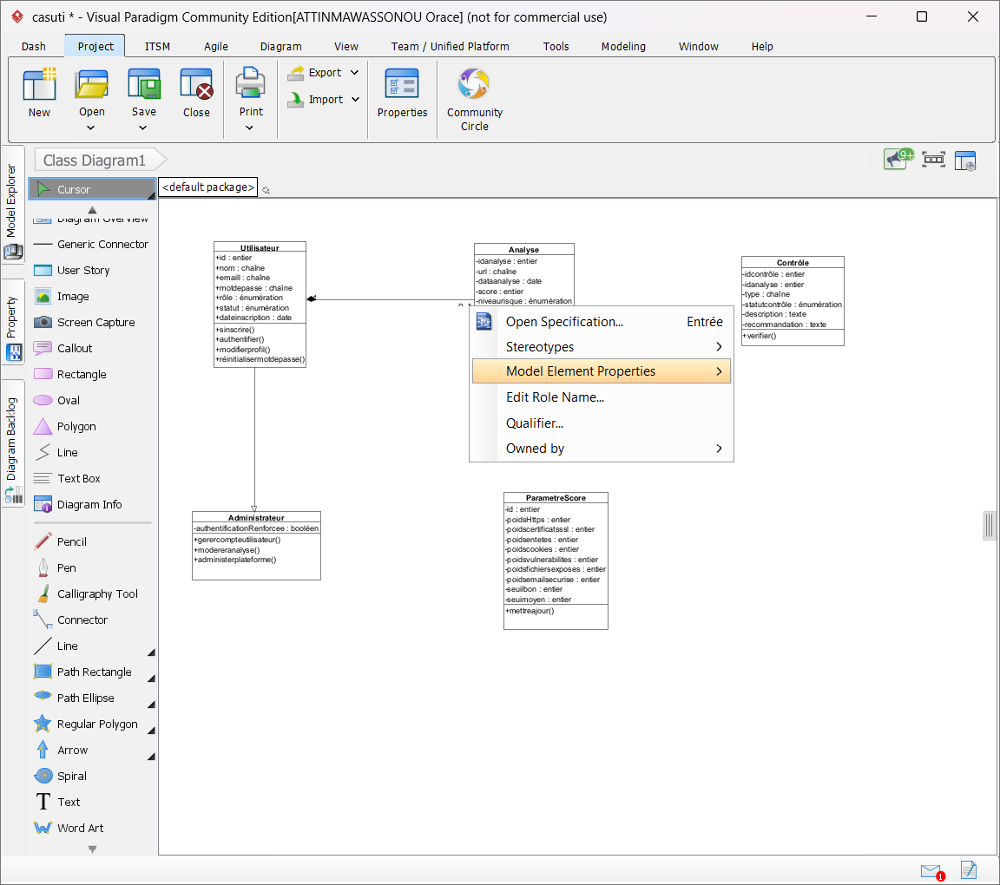

# Identification des acteurs et des cas d'utilisation

## Acteurs

| Acteur | Description |
|---|---|
| **Utilisateur** | Personne disposant d'un compte sur la plateforme, propriétaire ou responsable d'un site web qu'elle souhaite analyser. |
| **Administrateur** | Personne chargée de la gestion de la plateforme (comptes, statistiques, paramètres de scoring). Hérite de tous les droits de l'Utilisateur. |
| **Système** | Acteur non-humain : partie automatisée de l'application qui exécute les vérifications techniques et produit les résultats. |

## Cas d'utilisation

### Acteur : Utilisateur

- **Gérer son compte** — s'inscrire, modifier ses informations, réinitialiser son mot de passe.
- **S'authentifier** — se connecter (email/mot de passe, ou compte Google si un compte existe déjà avec cet email — Google n'est jamais un moyen d'inscription), se déconnecter.
- **Lancer une analyse** — saisir l'URL d'un site et déclencher une analyse de sécurité.
- **Consulter les rapports** — consulter l'historique et le détail des analyses, télécharger un rapport au format PDF.
- **Consulter le tableau de bord** — visualiser ses statistiques personnelles (nombre d'analyses, score moyen, évolution).
- **Être notifié de la fin d'une analyse** — recevoir une notification in-app lorsqu'une analyse lancée en arrière-plan se termine, sans avoir à recharger la page.

### Acteur : Administrateur

- **Gérer les comptes utilisateurs** — lister, activer/désactiver, promouvoir/rétrograder le rôle (administrateur ⇄ utilisateur), supprimer des comptes.
- **Modérer les analyses** — consulter la liste globale des analyses de tous les utilisateurs (recherche, filtres) et supprimer une analyse quelconque.
- **Administrer la plateforme** — consulter les statistiques globales, configurer les paramètres de scoring (pondération des critères, seuils de risque).

### Acteur : Système

- **Traiter l'analyse** — exécuter les vérifications techniques (HTTPS, certificat SSL, en-têtes de sécurité, cookies, vulnérabilités simples, fichiers sensibles exposés, sécurité email SPF/DMARC), calculer le score et le niveau de risque, générer le rapport PDF, enregistrer le résultat en base de données, puis notifier l'utilisateur si l'analyse était suivie en arrière-plan. Déclenché automatiquement par "Lancer une analyse".

## Récapitulatif

| # | Cas d'utilisation | Acteur |
|---|---|---|
| 1 | Gérer son compte | Utilisateur |
| 2 | S'authentifier | Utilisateur |
| 3 | Lancer une analyse | Utilisateur |
| 4 | Consulter les rapports | Utilisateur |
| 5 | Consulter le tableau de bord | Utilisateur |
| 6 | Être notifié de la fin d'une analyse | Utilisateur |
| 7 | Gérer les comptes utilisateurs | Administrateur |
| 8 | Modérer les analyses | Administrateur |
| 9 | Administrer la plateforme | Administrateur |
| 10 | Traiter l'analyse | Système |

## Description détaillée des cinq cas d'utilisation principaux

### 1. Lancer une analyse

| Élément | Détail |
|---|---|
| **Acteur principal** | Utilisateur |
| **Objectif** | Permettre à l'utilisateur de demander l'analyse de sécurité d'un site web. |
| **Précondition** | L'utilisateur est authentifié. |
| **Scénario nominal** | 1. L'utilisateur saisit l'URL du site à analyser. 2. Le système valide le format de l'URL. 3. Le système déclenche le cas d'utilisation "Traiter l'analyse". 4. Une confirmation de lancement est affichée à l'utilisateur. |
| **Postcondition** | Une analyse est en cours de traitement pour le site indiqué. |
| **Exception** | URL invalide ou site inaccessible → message d'erreur affiché, aucune analyse n'est lancée. |

### 2. Traiter l'analyse

| Élément | Détail |
|---|---|
| **Acteur principal** | Système |
| **Objectif** | Exécuter automatiquement les vérifications de sécurité et produire un résultat exploitable. |
| **Précondition** | Le cas "Lancer une analyse" a été déclenché avec une URL valide. |
| **Scénario nominal** | 1. Le système vérifie que l'hôte ne pointe pas vers une ressource réseau privée ou interne. 2. Le système vérifie la présence du HTTPS. 3. Le système contrôle la validité du certificat SSL. 4. Le système analyse les en-têtes de sécurité HTTP. 5. Le système vérifie la configuration des cookies (Secure, HttpOnly, SameSite). 6. Le système recherche des vulnérabilités simples et non intrusives. 7. Le système recherche des fichiers sensibles exposés publiquement (.env, .git...). 8. Le système vérifie la protection du domaine contre l'usurpation d'email (SPF/DMARC). 9. Le système calcule un score sur 100 et un niveau de risque. 10. Le système génère les recommandations correspondantes, en langage compréhensible par un non-technicien. 11. Le système génère le rapport PDF. 12. Le système enregistre le résultat en base de données. 13. Le système notifie l'utilisateur si l'analyse était suivie en arrière-plan ("Être notifié de la fin d'une analyse"). |
| **Postcondition** | Un rapport d'analyse (score, risque, recommandations, PDF) est disponible et associé à l'utilisateur. |
| **Exception** | Adresse non autorisée, site inaccessible ou timeout → l'analyse est marquée en échec avec un motif explicite, l'utilisateur est notifié. |

### 4. Gérer les comptes utilisateurs

| Élément | Détail |
|---|---|
| **Acteur principal** | Administrateur |
| **Objectif** | Permettre à un administrateur de gérer les comptes des utilisateurs de la plateforme (statut, rôle). |
| **Précondition** | L'administrateur est authentifié. |
| **Scénario nominal** | 1. L'administrateur accède à la liste des comptes utilisateurs. 2. Le système affiche la liste (nom, email, rôle, statut, nombre d'analyses). 3. L'administrateur recherche par nom/email, filtre par statut. 4. L'administrateur active ou désactive un compte. 5. L'administrateur promeut ou rétrograde le rôle d'un compte (utilisateur ⇄ administrateur). 6. L'administrateur supprime un compte si nécessaire. |
| **Postcondition** | L'état du compte ciblé (statut, rôle, ou existence) est mis à jour en conséquence. |
| **Exception** | Tentative d'un administrateur de désactiver, rétrograder ou supprimer son propre compte → refusée (garde-fou anti-auto-modification). Tentative d'accès par un utilisateur non administrateur → accès refusé. |

### 5. Modérer les analyses

| Élément | Détail |
|---|---|
| **Acteur principal** | Administrateur |
| **Objectif** | Permettre à un administrateur de superviser l'ensemble des analyses de la plateforme, tous utilisateurs confondus, et d'en supprimer une si nécessaire. |
| **Précondition** | L'administrateur est authentifié. |
| **Scénario nominal** | 1. L'administrateur accède à la liste globale des analyses. 2. Le système affiche toutes les analyses avec leur propriétaire, indépendamment de l'utilisateur connecté. 3. L'administrateur recherche par URL ou par propriétaire, filtre par niveau de risque. 4. L'administrateur consulte le détail d'une analyse. 5. L'administrateur supprime l'analyse si nécessaire. |
| **Postcondition** | La liste reflète l'état courant des analyses ; une analyse supprimée (et son rapport PDF) n'est plus disponible. |
| **Exception** | Tentative d'accès par un utilisateur non administrateur → accès refusé. |

### 3. Consulter les rapports

| Élément | Détail |
|---|---|
| **Acteur principal** | Utilisateur |
| **Objectif** | Permettre à l'utilisateur de revoir ses analyses passées et d'en récupérer le détail. |
| **Précondition** | L'utilisateur est authentifié et possède au moins une analyse terminée. |
| **Scénario nominal** | 1. L'utilisateur accède à son historique d'analyses. 2. Le système affiche la liste des analyses (date, site, score, niveau de risque). 3. L'utilisateur sélectionne une analyse. 4. Le système affiche le détail du rapport. 5. L'utilisateur peut télécharger le rapport au format PDF. |
| **Postcondition** | L'utilisateur a consulté ou téléchargé le rapport souhaité. |
| **Exception** | Aucune analyse enregistrée → message indiquant qu'aucun historique n'est disponible. |

## Liste des écrans (base pour les maquettes)

| Écran | Description |
|---|---|
| **Accueil** (avec modal d'authentification au premier plan) | Page de présentation du service en arrière-plan ; formulaire Connexion ⇄ Inscription superposé dès l'arrivée, fermable pour explorer l'accueil. |
| Mot de passe oublié | Formulaire de demande de réinitialisation |
| Mon profil | Modifier infos, changer mot de passe |
| Tableau de bord | Statistiques personnelles |
| Nouvelle analyse | Saisie URL |
| Résultat d'analyse | Score, détail, recommandations |
| Historique / liste des rapports | Liste des analyses passées |
| Détail d'un rapport + PDF | Détail + téléchargement |
| Administration — utilisateurs | Gestion des comptes (statut, rôle) |
| Administration — analyses | Vue globale et modération des analyses de tous les utilisateurs |
| Administration — statistiques & paramètres | Stats globales + config scoring |
